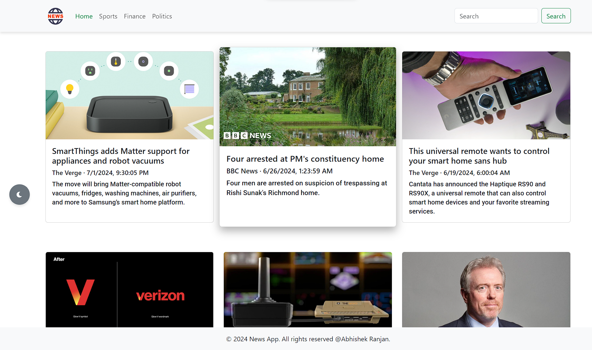
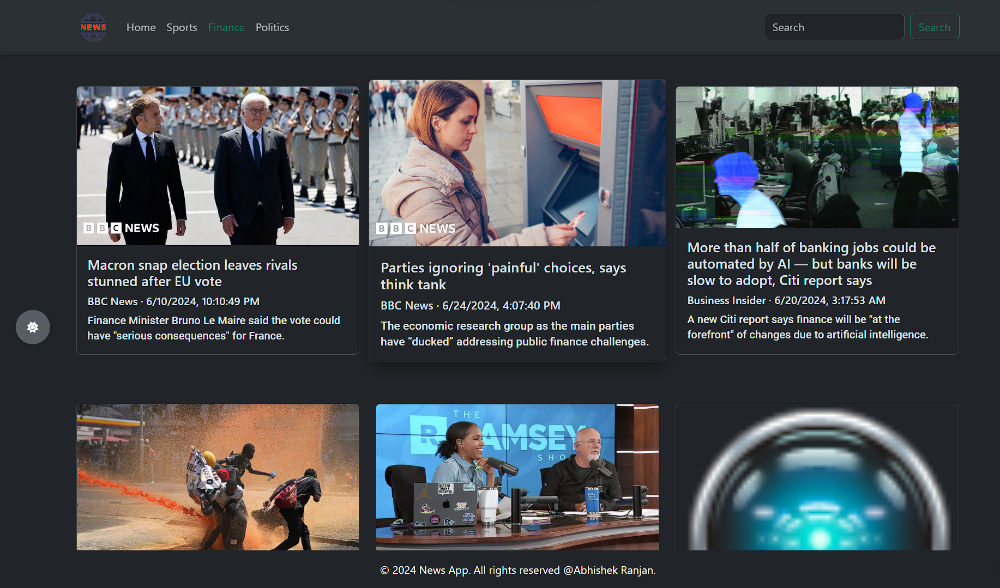

# News App
## Preview
### Light Mode | Dark Mode
 | 

## Table of Contents
- [Introduction](#introduction)
- [Features](#features)
- [Getting Started](#getting-started)
- [Contributing](#contributing)
- [License](#license)

## Introduction
News App is a web application built with HTML, CSS, and JavaScript that allows users to read daily news anytime. It fetches news articles from the News API and presents them in a user-friendly and fully responsive interface. The app also supports dark mode for a better reading experience in low-light environments.

## Features
- Fetches news from News API
- Search news on any topics 
- User-friendly interface
- Fully responsive design
- Dark mode support
- Real-time news updates

## Getting Started
### Prerequisites
To run this project locally, you need a modern web browser that supports HTML5, CSS3, and JavaScript.

### Installation
1. Clone the repository:
    ```bash
    git clone https://github.com/meabhi2206/news.app.git
    ```
2. Navigate to the project directory:
    ```bash
    cd news.app
    ```
3. Open `index.html` in your web browser to start using the News App.

### Configuration
1. Obtain an API key from [News API](https://newsapi.org/).
2. Open the `config.js` file and replace `YOUR_API_KEY` with your News API key:
    ```javascript
    const API_KEY = 'YOUR_API_KEY';
    ```
3. **Important Note:** Make sure to use your own APIs to ensure proper functionality and to comply with the API provider's terms of service.

## Contributing
We welcome contributions to enhance the News App. To contribute, please follow these steps:
1. Fork the repository.
2. Create a new branch:
    ```bash
    git checkout -b feature/your-feature-name
    ```
3. Make your changes and commit them:
    ```bash
    git commit -m "Add your commit message"
    ```
4. Push to the branch:
    ```bash
    git push origin feature/your-feature-name
    ```
5. Open a pull request detailing your changes.

## License
This project is licensed under the MIT License. See the [LICENSE](LICENSE) file for details.
